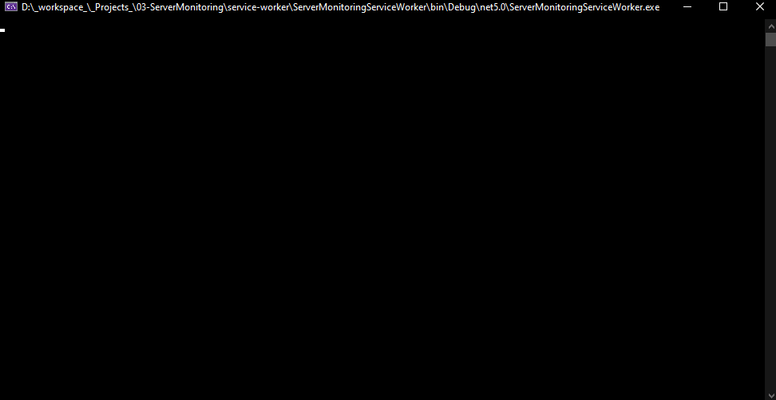

[![MIT License][license-shield]][license-url]
[![LinkedIn][linkedin-shield]][linkedin-url]

<h1 align="center">
	<b>SERVER MONITORING</b>
	<br />
	<small align="center">Service Worker</small>
</h1>

<details open="open">
  <summary>Table of Contents</summary>
<!-- TOC depthfrom:1 -->

-   [About The Project](#about-the-project)
    -   [Build with](#build-with)
-   [Getting Started](#getting-started)
    -   [Prerequisites](#prerequisites)
    -   [Installation](#installation)
        -   [Linux](#linux)
        -   [Windows](#windows)
-   [Roadmap](#roadmap)
-   [License](#license)
-   [Contact](#contact)

<!-- /TOC -->
</details>

## About The Project

Web application allowing to have information on a server, with the possibility to add links to local web servers and services (Service Worker).

-   [Back End](https://github.com/KristenJestin/server-monitoring-back)
-   [Front End](https://github.com/KristenJestin/server-monitoring-front)



### Build with

-   [NET Core](https://dotnet.microsoft.com)
-   [Flurl](https://flurl.dev/)
-   [Serilog](https://serilog.net/)

## Getting Started

### Prerequisites

-   [NET Core 5](https://dotnet.microsoft.com/download/dotnet/5.0)

### Installation

1. Install the Back and front end part [Server Monitoring - Service Worker](https://github.com/KristenJestin/server-monitoring-back#installation)
2. Clone the repo
    ```sh
    git clone https://github.com/KristenJestin/server-monitoring-service-worker.git
    ```

#### Linux

3. Build the project
    ```sh
    dotnet build ServerMonitoringServiceWorker /p:PublishProfile=Linux
    ```
4. Go in `bin/Release/Linux` and Create service file

    ```ini
    [Unit]
    Description=Demo worker

    [Service]
    Type=notify
    WorkingDirectory=/PATH_TO_BUILD_FOLDER/server-monitoring-service-worker
    ExecStart=/PATH_TO_BUILD_FOLDER/server-monitoring-service-worker/ServerMonitoringServiceWorker

    [Install]
    WantedBy=multi-user.target
    ```

5. Start service

    ```sh
    ln -rs service /etc/systemd/system/demo-worker.service

    systemctl daemon-reload

    systemctl start demo-worker.service

    systemctl enable demo-worker.service
    ```

#### Windows

3. Build the project
    ```sh
    dotnet build ServerMonitoringServiceWorker /p:PublishProfile=Windows
    ```
4. Go in `bin/Release/Windows` and Create service (in Admin mode)
    ```sh
    sc create DemoWorker binPath="PATH_TO_BUILD_FOLDER\ServerMonitoringServiceWorker.exe" start=auto
    ```
5. Start service
    ```sh
    sc start DemoWorker
    ```

## Roadmap

All future features are available on [Trello](https://trello.com/b/5A8iO3Xc/%F0%9F%93%8A-server-monitoring).


## License

Distributed under the MIT License. See `LICENSE` for more information.

<!-- CONTACT -->

## Contact

Kristen JESTIN - [contact@kristenjestin.fr](mailto:contact@kristenjestin.fr)

Project Link: [https://github.com/KristenJestin/server-monitoring-service-worker](https://github.com/KristenJestin/server-monitoring-service-worker)

<!-- MARKDOWN LINKS & IMAGES -->

[license-shield]: https://img.shields.io/github/license/KristenJestin/server-monitoring-service-worker.svg?style=for-the-badge
[license-url]: https://github.com/KristenJestin/server-monitoring-service-worker/blob/master/LICENSE
[linkedin-shield]: https://img.shields.io/badge/-LinkedIn-black.svg?style=for-the-badge&logo=linkedin&colorB=555
[linkedin-url]: https://linkedin.com/in/kristen-jestin
